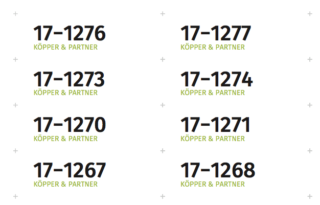

# Print Filing Labels

This is a small PostScript program that prints filinig labels 58mm x
18mm arranged in a table of 3 by 15 labels per DIN A4 page. Each label
is printed with two numbers like in "17-1234" where the second number
is a sequence number.

The specific format is tailored for [Köpper und
Partner](https://www.schaden-manager.de), an office for insurance loss
adjustment, but it is easy to change. See the definitions at the top of
the PostScript file.

## Building

Use `make` to build the PostScript file and from that a PDF.

## License

This code is licensed under the MIT license. This repository contains
fonts from the [Fira Type Family](https://github.com/mozilla/Fira),
released by Mozilla.

